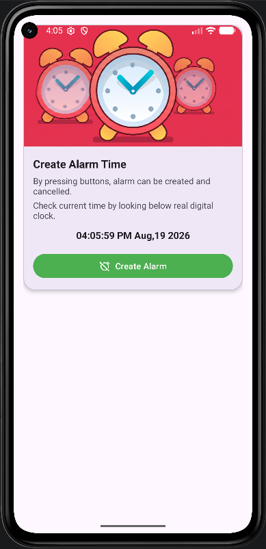
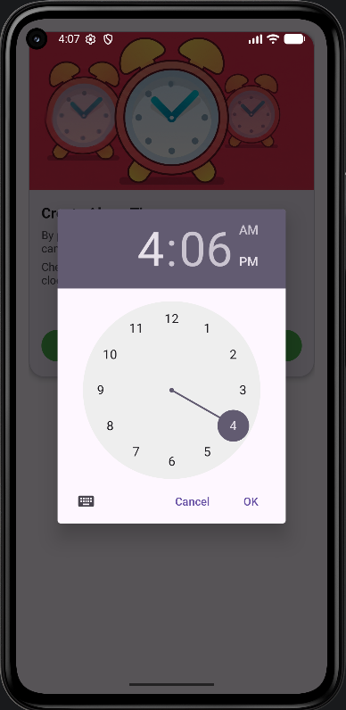
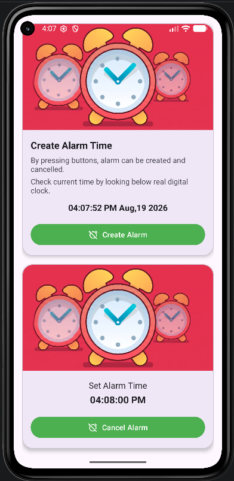
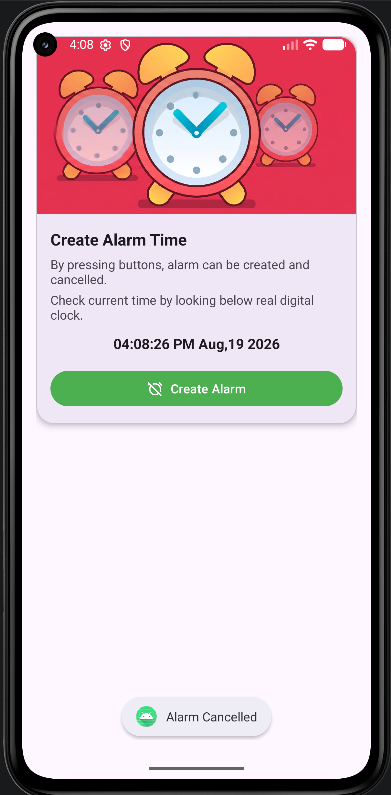

## Practical-4

---

**Aim:** Create an Android Alarm application by using service & BroadcastReceiver.

## Project Description

---

This application demonstrates how to schedule tasks in Android using the `AlarmManager` and how to handle background tasks using a `Service` and a `BroadcastReceiver`.

## Key Components:

---

*   **MainActivity:** The user interface where users can select a time using a `TimePickerDialog`. It calculates the remaining time and schedules the alarm.
*   **AlarmManager:** Used to schedule the alarm at a precise time, even if the application is not running.
*   **AlarmBroadcastReceiver:** A background component that wakes up when the alarm triggers. It receives the intent from `AlarmManager` and starts the `AlarmService`.
*   **AlarmService:** A background service that manages the playback of the alarm ringtone using `MediaPlayer`. It ensures the music continues playing until the user cancels it.
*   **Material Design UI:** Uses `MaterialCardView`, `MaterialButton` for a modern, responsive user interface.
## Screenshots

---

| Screenshot 1 | Screenshot 2 | Screenshot 3 | Screenshot 4 |
| :---: | :---: | :---: | :---: |
|  |  |  |  |

**Enrollment No:** 24012011097 **Last Updated:** August 19, 2026
